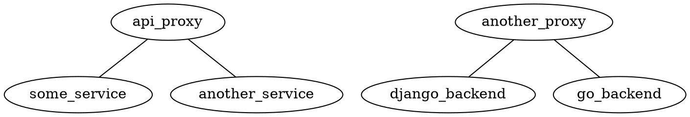

# dotgraph-vizceral

### Description

A very basic tool that transforms dotgraph data into Vizceral traffic data.

Can transform any graph (either directional or not) where nodes are names (IDs)
of microservices and edges are connections between them. For example:



### Running the demo

Clone the repo first.

```bash
git clone https://github.com/brotheroftux/dotgraph-vizceral
cd dotgraph-vizceral
```

Then you'll need to install npm dependencies.

```bash
npm install
```

or 

```bash
yarn install
```

Run it in WDS (available as `localhost:8080`)

```bash
npm run dev
```

or

```bash
yarn dev
```